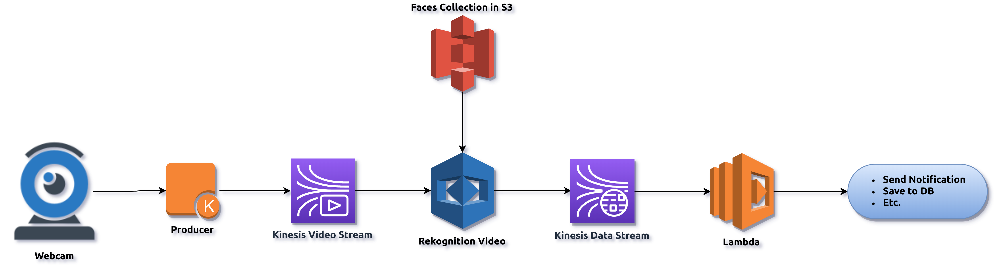

# AWS Realtime Face Recognition

Follow these steps to stream live video from Android to Kinesis:
* In Android:
  * Install [IP Webcam](https://play.google.com/store/apps/details?id=com.pas.webcam).
  * Set ```Video preferences``` > ```Video resolution``` to ```640x480```.
  * Set ```Audio mode``` to ```Disabled```.
  * Tap ```Start server```.
* In PC:
  * Run ```docker run -e AWS_DEFAULT_REGION=<your-region> -it kmharish/kvs-producer <access-key-id> <secret-access-key> rtsp://<android-ip>:8080/h264_pcm.sdp harish-poc```
